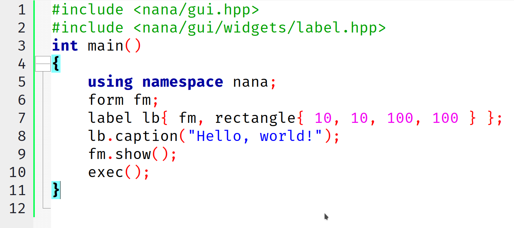
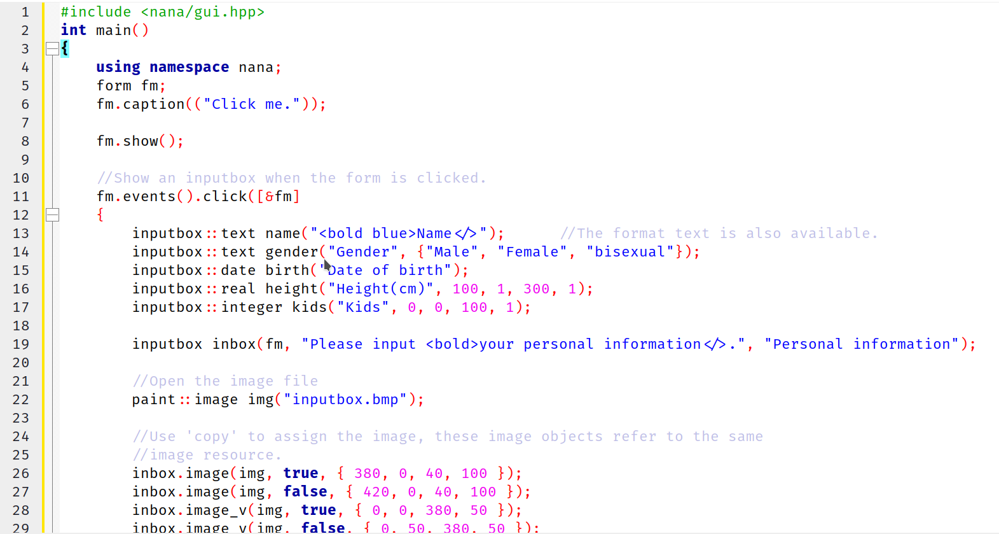
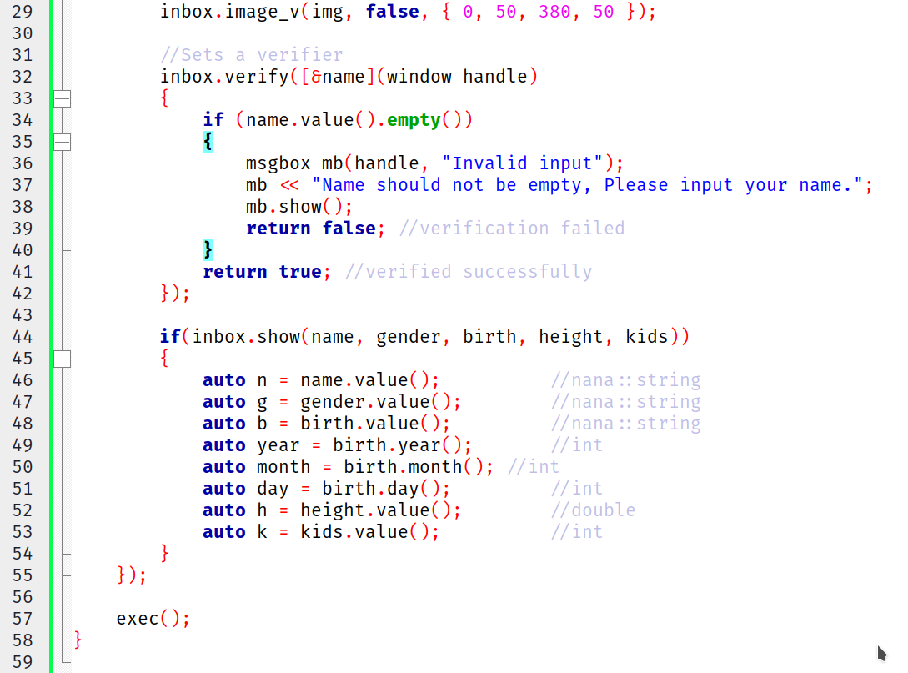
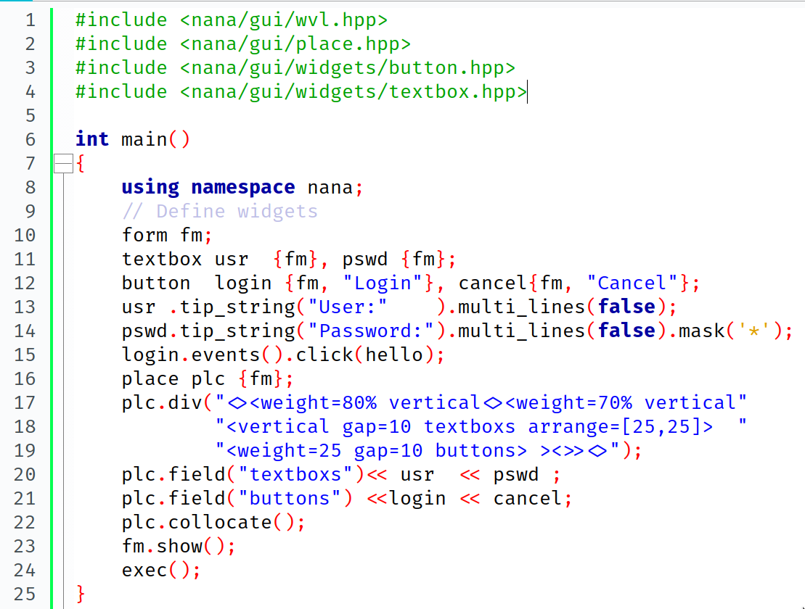

# ใบงานที่ 12 การเขียนโปรแกรมแบบ GUI ด้วย Nana Library

## เริ่มต้นเขียนโปรแกรมกับ Nana

1.  โหลด source code ของ Nana ได้ที่ <https://sourceforge.net/projects/nanapro/files/latest/download>
2.  แตกไฟล์ที่ดาวน์โหลดมา และจดจำตำแหน่งไว้
3.  ติดตั้ง Nana ซึ่งมีขั้นตอนดังนี้ (สำหรับ code blocks บน Windows)
    1.  ตั้งค่า Directories
        1.  คลิกที่เมนู Settings -> Compiler -> Search directory -> Compiler
        2.  คลิกปุ่ม Add แล้วเลือกตำแหน่ง NanaPath/include
        3.  ไปที่ Linker แล้วเพิ่ม NanaPath/build/codeblocks
    2.  Compile Nana Library
        1.  เปิดโปรเจ็คที่ NanaPath/build/codeblocks/nana.cbp
        2.  คลิกเมนู Project -> Build options -> Compiler settings -> Compilers flags และเลือกเปิดใช้งาน "-std=c++11"
        3.  คลิกเมนู Project -> Build options -> Search Directories -> Compiler และเพิ่ม $(#nana) กับ $(#boost)
        4.  กด Build
    3.  เตรียมพร้อมสำหรับการเขียนโปรแกรมด้วย Nana
        1.  สร้างโปรเจ็ค และไปที่ Project -> Build options -> Compiler settings -> Compilers flags และเลือกเปิดใช้งาน "-std=c++11"
        2.  ใน tab Linker ให้เพิ่มข้อมูลดังนี้ nan gdi32 comdlg32

## โปรแกรมที่ 1

1.  สร้าง projects และไปที่ Project -> Build options -> Compiler settings -> Compilers flags และเลือกเปิดใช้งาน "-std=c++11" ใน tab Linker ให้เพิ่มข้อมูลดังนี้ nana gdi32 comdlg32
2.  เขียนโปรแกรมตามที่กำหนด 
3.  รันโปรแกรม ถ้าขึ้นหน้าต่างที่มีคำว่า Hello World ถือว่าถูกต้อง

## โปรแกรมที่ 2

1.  สร้าง projects และไปที่ Project -> Build options -> Compiler settings -> Compilers flags และเลือกเปิดใช้งาน "-std=c++11" ใน tab Linker ให้เพิ่มข้อมูลดังนี้ nana gdi32 comdlg32
2.  เขียนโปรแกรมตามที่กำหนด

    

    

3.  รันโปรแกรม ถ้าขึ้น form ถือว่าถูกต้อง

## โปรแกรมที่ 3

1.  สร้าง projects และไปที่ Project -> Build options -> Compiler settings -> Compilers flags และเลือกเปิดใช้งาน "-std=c++11" ใน tab Linker ให้เพิ่มข้อมูลดังนี้ nana gdi32 comdlg32
2.  เขียนโปรแกรมตามที่กำหนด

    

3.  รันโปรแกรม จะขึ้นหน้า login
4.  พัฒนาโปรแกรมให้สามารถตรวจสอบ user และ password ได้ โดยกำหนด user เป็น ankworld password เป็น 1234 เมื่อทั้งสองถูกต้องให้แสดงหน้า form เปล่าขึ้นมาใหม่
